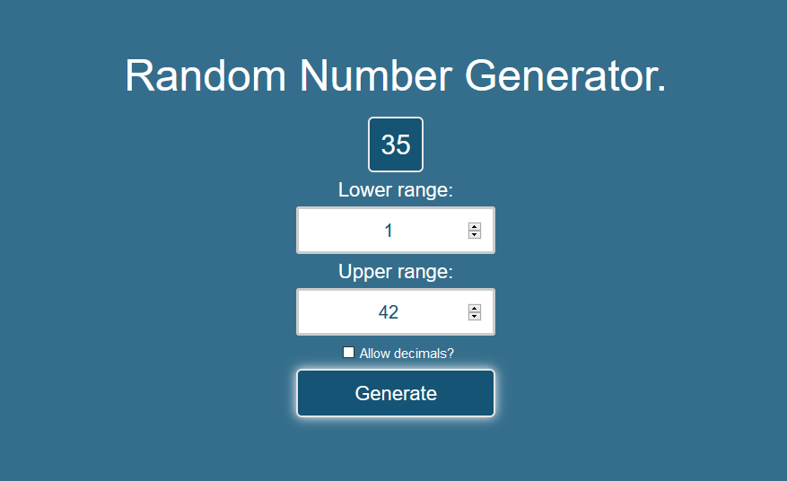

# Random Number Generator
###### Input two numbers to generate a random number within that range

I built this beginner project to learn about using user input in Javascript, as well as returning information to the DOM after calling a function.

